# RTLDesignusingVerilogwithSKY130Technology

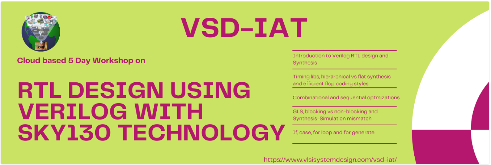

# 5 Days Workshop on "Basic RTL Verilog Design and Synthesis Using Sky130PDKs" 

This workshop covers the topics from fundamental to cirtical issues faced by RTL Designers & Synthesis Engineers in VLSI Industry  
The course bascially includes following 3 Major Parts  
* Verilog Coding Guidelines , Writing Testbench & Validating the Design as per Specification  
* Converting Logic in Synthesizable Design & Optimization  
* Validating the Synthesized Design to Match as per Specification  

# Table of Contents

## Day 1 - Introduction to Verilog RTL design and Synthesis
Introduction to open-source simulator iverilog 
Labs using iverilog and gtkwave 
Introduction to Yosys and Logic synthesis 
Labs using Yosys and Sky130 PDKs 

## Day 2 - Timing libs, hierarchical vs flat synthesis and efficient flop coding styles
Introduction to timing .libs 
Hierarchical vs Flat Synthesis 
Various Flop Coding Styles and optimization 

## Day 3 - Combinational and sequential optimizations
Introduction to optimizations 
Combinational logic optimizations 
Sequential logic optimizations 
Sequential optimzations for unused outputs 

## Day 4 - GLS, Blocking vs Non-Blocking and Synthesis-Simulation Mismatch 
### GLS,Sythesis-Simulation Mismatch and Blocking/Non-Blocking Statements 
#### About GLS 
#### Types of GLS 
#### Synthesis Simulation Mismatch
### LABS
#### Lab Part-1  GLS and Synthesis-Simulation Mismatch 
#### Lab Part-2  Synth-Sim Mismatch for Blocking Statement 

## Day 4 - GLS, Blocking vs Non-Blocking and Synthesis-Simulation Mismatch
### GLS,Sythesis-Simulation Mismatch and Blocking/Non-Blocking Statements 

#### About GLS
When RTL gets synthesised to Netlist , it is expected to have same functionality in netlist also.

To Ensure RTL & Netlist functionality are matching 
* First level of check : Logical Equivalence Check (LEC) is performed between RTL & Netlist which reports if there is any mismatch
* Second Level of check : Gate Level Simulation (GLS) which means running the testbench with netlist as design under test
Since the  functionality of the RTL & Netlist is expected to be same , hence same testbench is used to run both at RTL & Netlist level

All functional mismatch are not identified by LEC , Hence Second level of check GLS is required  

#### Types of GLS
1) Zero Delay : Zero delay simulation means simulating the netlist without annotating any timing data
2) Unit Delay : Simulation with assumption that all elements in the design have unit delay
3) SDF /Timing Simulation : Actual Delay Simulation

#### Synthesis Simulation Mismatch

Synthesis Simulation Mismatch can be because of following reasons : -
1) Missing Sensitivity List
2) Blocking vs Non-Blocking Assigments
3) Non Standard Verilog Coding 

#### LABS
#### Aim  : Taking different design, analysing them at RTL level , synthesizing & Verifying them with GLS
#### Input Required: 
1) For RTL sims 
-> RTL Design : <verilog_model.v>
-> Testbench  : <testbench_verilog_model.v>
2) For Synthesis & GLS
-> Liberty File 
-> Primitive 
-> Standard Cell Verilog Model

### Lab Part-1 - GLS and Synthesis-Simulation Mismatch 

#### Design 1: Mux implement using Ternary Operator 

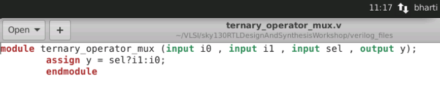

#### Figure 4.1.1 Verilog Model  

when sel is 1 , output y will have value from i1 
when sel is 0 , output y will have value from io
  
  
  

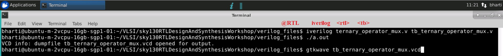

#### Figure 4.1.2 Performing Simulation   

iverilog command is used to dump the VCD (value change dump) & VCD is analysed using GTKwave
  
 
  

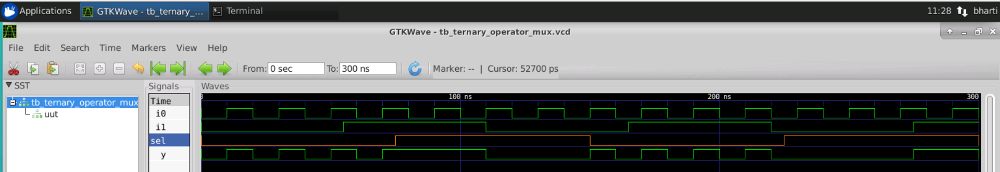

#### Figure 4.1.3 Output Waveform  

Above waveform clearly shows the the expected values at y when sel is changing 
  
  
  

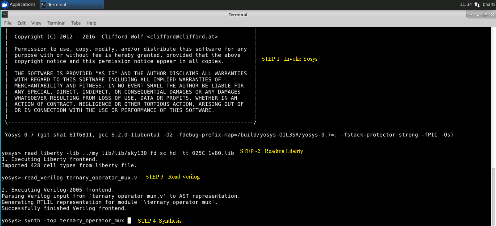

#### Figure 4.1.4 Synthesis  

Invoking yosys for synthesis & reading the input files 
  
 
  

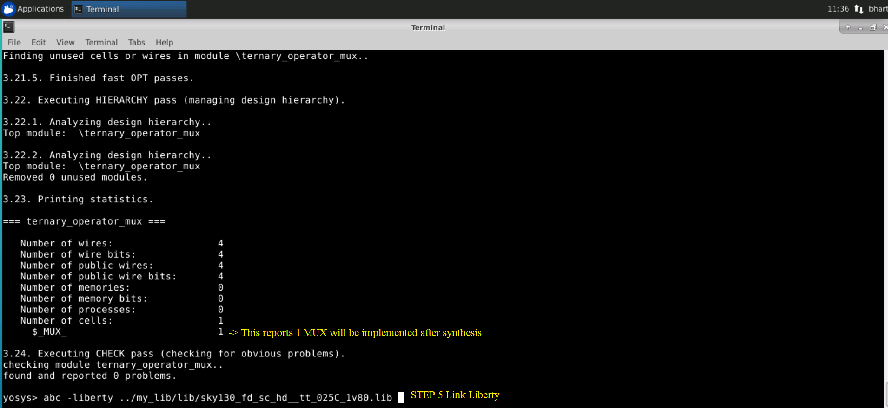

#### Figure 4.1.5 Synthesis  

After synthesis is performed , it reports with the cell(type&number) that is taken to build netlist
  
 
  

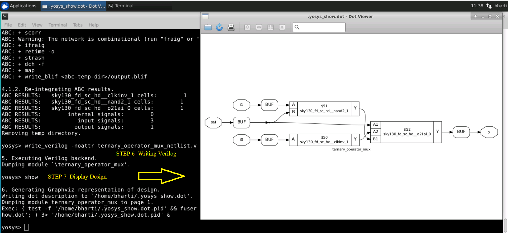

#### Figure 4.1.6 Synthesis  

Dumping the netlist & displaying the implementing design
Hence we can see that 2X1 is implemented using nand,or & invertor 
  
 
  

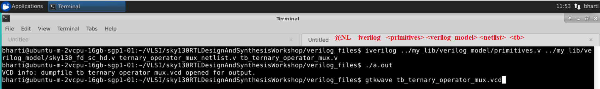

#### Figure 4.1.7 GLS  

Performing GLS using primitives & verilog models for standard cell using the netlist dump at previous step with the same testbench which was used for RTL simulation 
  
 
  

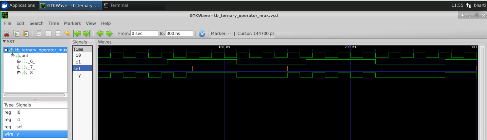

On comparing the RTL & NL waveform it correctly matches 

#### Figure 4.1.8 GLS Output  
  
  
*Note*: Above waveform matches with the waveform at RTL level which verifies the design is implemented correctly
  
  
#### Design 2: Bad Mux  

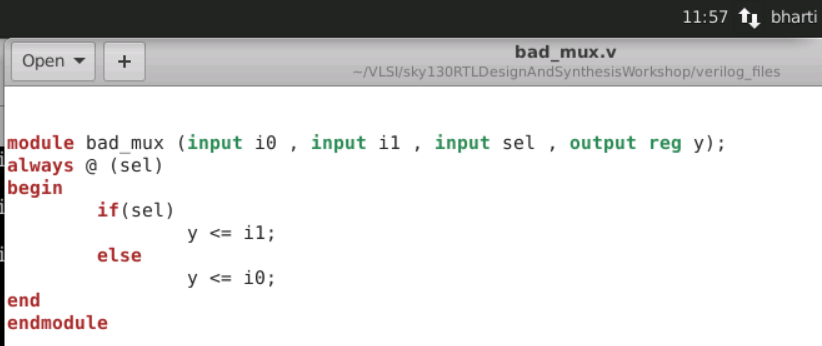

#### Figure 4.2.1 Verilog Model  

Mux sensitivity list has sel which means the output will be changing only if there is a change in selection line
Hence the change in input if sel if not changing will not be reflected.
  
 
  

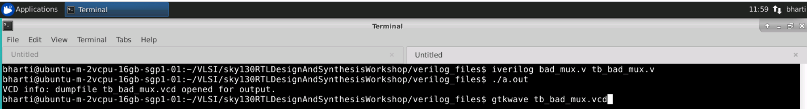

#### Figure 4.2.2 Performing Simulation  

iverilog command is used to dump the VCD (value change dump) & VCD is analysed using GTKwave
  
 
  

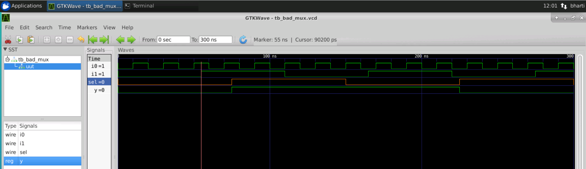

#### Figure 4.2.3 Waveform  

Waveform clearly shows that change in output depends only on change in sel & if change in io is no reflected 
  
 
  

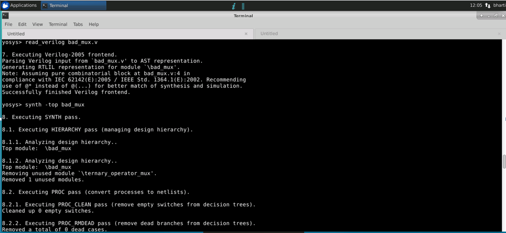

#### Figure 4.2.4 Synthesis  

Invoking yosys for synthesis & reading the input files 
  
 
  

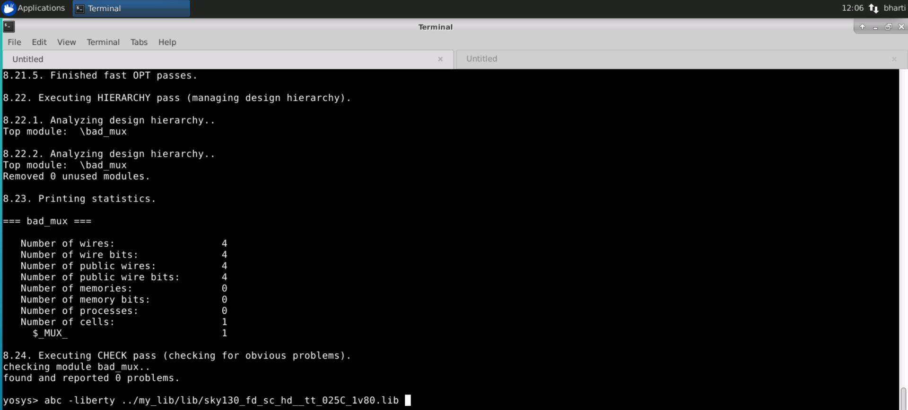

#### Figure 4.2.5 Synthesis  

After synthesis is performed , it reports with the cell(type&number) that is taken to build netlist
  
 
  

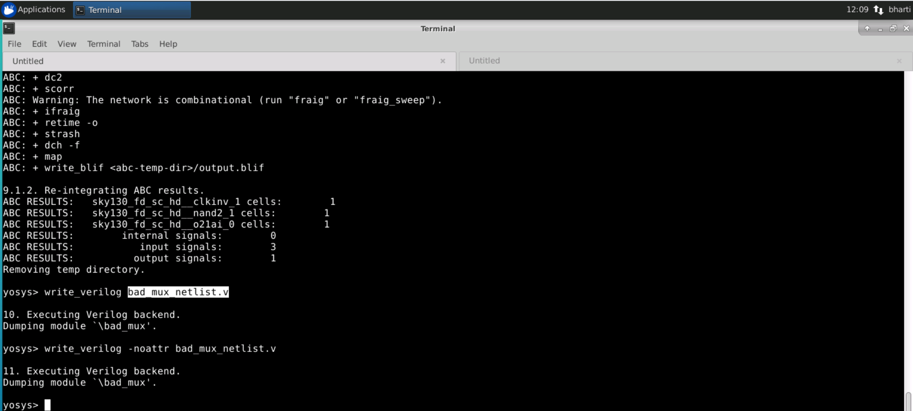

#### Figure 4.2.6 Synthesis  

Dumping the netlist & displaying the implementing design
  
 
  

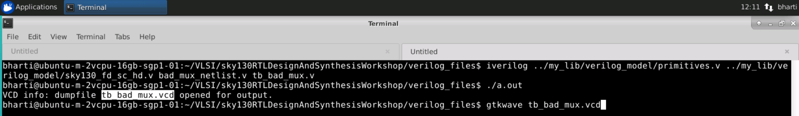

#### Figure 4.2.7 GLS  

Performing GLS using primitives & verilog models for standard cell using the netlist dump at previous step with the same testbench which was used for RTL simulation 
  
 
  

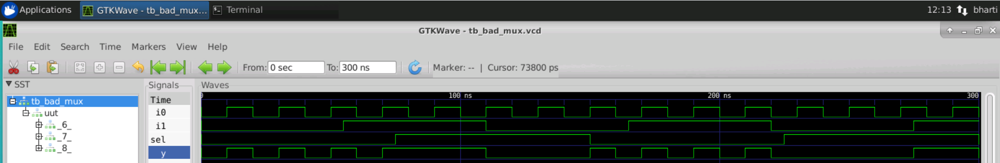

#### Figure 4.2.8 GLS Output  

Above waveform correctly shows the behaviour of MUX but on comparison with the waveform at RTL level we see there is a mismatch.
Here the change in Io is clearly seen at the output if if the sel of the MUX is not changing but when it comes to RTL level due to wrong sensitivity list the output of the MUX is only changing at sel
  
  
*Note* : Above lab experiments shows that wrong sensitivity list can cause GLS simulation mismatch
  
  
#### Lab Part-2  Synth-Sim Mismatch for Blocking Statement 
  
  
#### Design 3: Blocking Caveat Design    

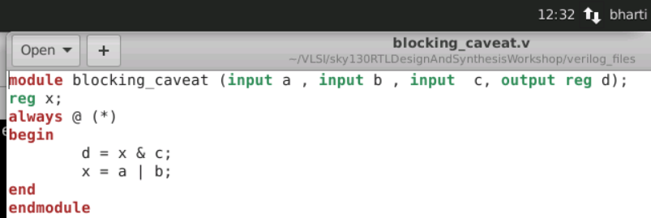

#### Figure 4.3.1 Verilog Model  

Above is the example of blocking statements used in the RTL design 
  
 
  

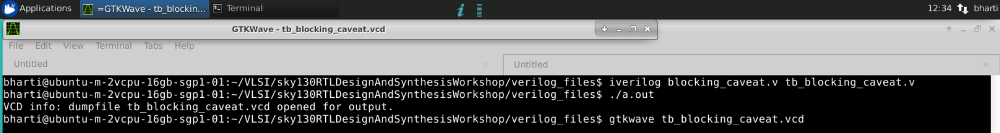

#### Figure 4.3.2 Performing Simulation  

iverilog command is used to dump the VCD (value change dump) & VCD is analysed using GTKwave
  
 
 

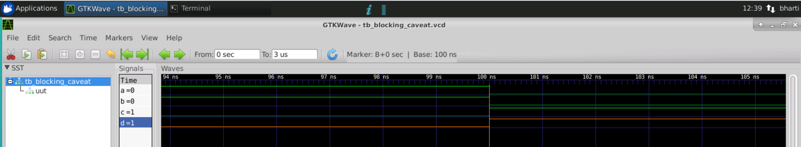

#### Figure 4.3.3 Waveform  

O/p is wrong , D cannot be 1 , so clearly it is looking at past values. Looking as if there is a flop here
  
 
 

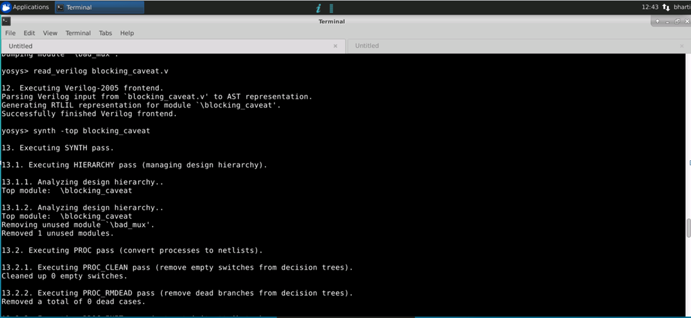

#### Figure 4.3.4 Synthesis  

Invoking yosys for synthesis & reading the input files 
  
 
  

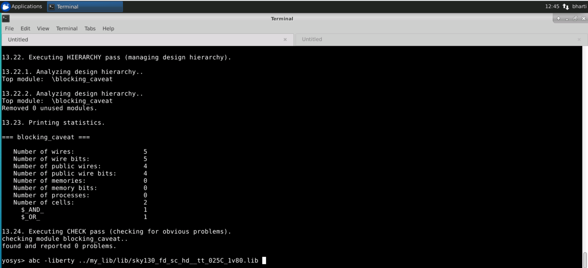

#### Figure 4.3.5 Synthesis  

After synthesis is performed , it reports with the cell(type&number) that is taken to build netlist
  
 
  

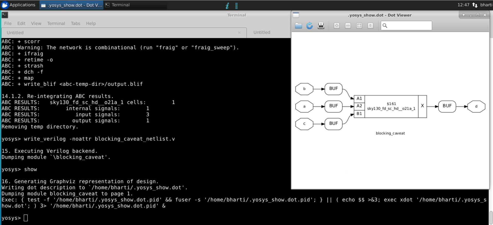

#### Figure 4.3.6 Synthesis  

After synthesis is performed , it reports with the cell(type&number) that is taken to build netlist
  
 
  

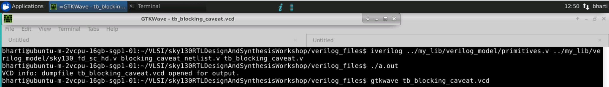

#### Figure 4.3.7 GLS  

Performing GLS using primitives & verilog models for standard cell using the netlist dump at previous step with the same testbench which was used for RTL simulation 
  
 
  

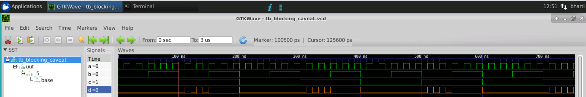

#### Figure 4.3.8 GLS Output  

@RTL level : a=0,b=0,c=1 O/p d=1
@NL level  : a=0,b=0,c=1 O/p d=0 which clearly shows that the there is a GLS mismatch
 
  
*Note* : Above lab experiment shows that block statements can cause GLS mismatch. hence it recommended to use non-blocking statement
 
  
#### Design 4: Shift Register using Non-Blocking Statment  

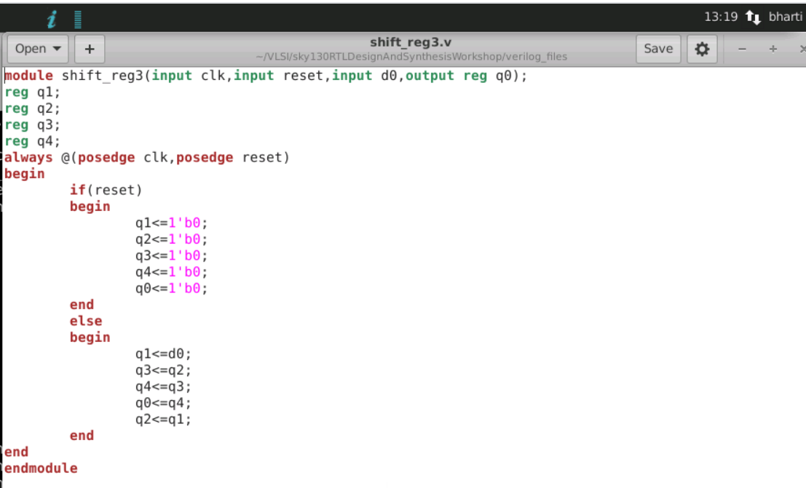

#### Figure 4.4.1  

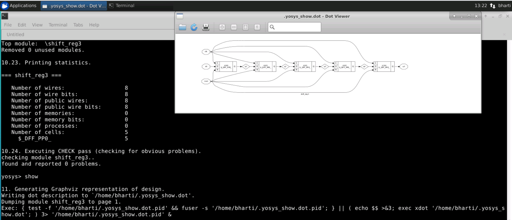

#### Figure 4.4.2  
 
  
#### Design 5: Shift Register using Blocking Statment  

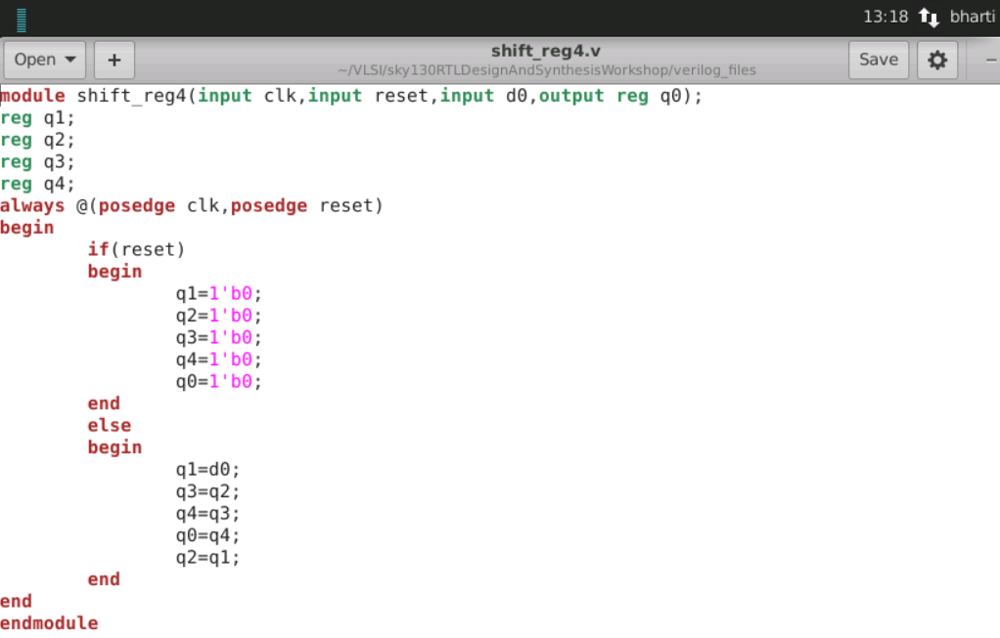

#### Figure 4.5.1  

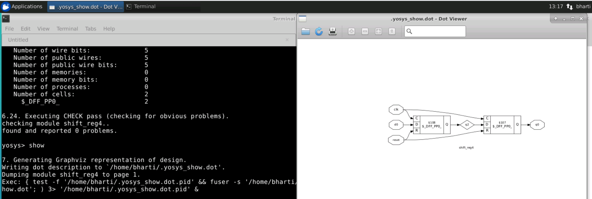

#### Figure 4.5.2  
 
  
*Note* : Above 2 lab experiment shows how blocking & non-blocking statements can cause hardware change
 
  

