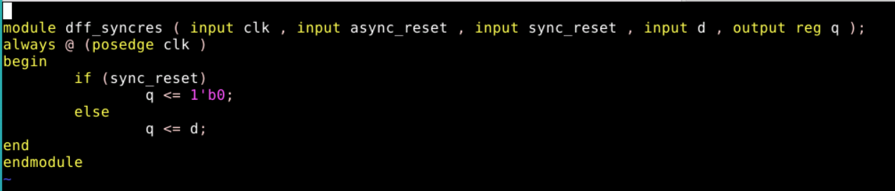

# RTLDesignusingVerilogwithSKY130Technology


# 5 Days Workshop on "Basic RTL Verilog Design and Synthesis Using Sky130PDKs" 

This workshop covers the topics from fundamental to cirtical issues faced by RTL Designers & Synthesis Engineers in VLSI Industry <br />
The course bascially includes following 3 Major Parts <br />
* Verilog Coding Guidelines , Writing Testbench & Validating the Design as per Specification <br />
* Converting Logic in Synthesizable Design & Optimization <br />
* Validating the Synthesized Design to Match as per Specification <br />

# Table of Contents

## Day 1 - Introduction to Verilog RTL design and Synthesis
  -Introduction to open-source simulator iverilog<br />
  -Labs using iverilog and gtkwave<br />
  -Introduction to Yosys and Logic synthesis<br />
  -Labs using Yosys and Sky130 PDKs<br />

## Day 2 - Timing libs, hierarchical vs flat synthesis and efficient flop coding styles
  -Introduction to timing .libs<br />
  -Hierarchical vs Flat Synthesis<br />
  -Various Flop Coding Styles and optimization<br />

## Day 3 - Combinational and sequential optimizations
  -Introduction to optimizations<br />
  -Combinational logic optimizations<br />
  -Sequential logic optimizations<br />
  -Sequential optimzations for unused outputs<br />

## Day 4 - GLS, Blocking vs Non-Blocking and Synthesis-Simulation Mismatch<br />
  -GLS,Sythesis-Simulation Mismatch and Blocking/Non-Blocking Statements<br />
    -About GLS<br />
    -Types of GLS<br />
  -Synthesis Simulation Mismatch
  -LABS
    Lab Part-1  GLS and Synthesis-Simulation Mismatch<br />
    Lab Part-2  Synth-Sim Mismatch for Blocking Statement<br />

## Day 1 - Introduction to Verilog RTL design and Synthesis

Summary: 
• Yosys tool is used to covert     RTL -> NL which takes input as RTL & .lib<br />
• Iverilog is a tool which is use for simulation both at RTL & NL level<br />
• Lib is collection of all the modules all sc – and 2 input , 3 input etc , slow version , fast version , medium version<br />
• Fast cells are required so that we have less progation delay<br />
• Slower cells are required to meet hold timing <br />
• Wider cell -> Low Delay -> More area & power<br />
• Narrow Transitor -> More Delay -> Less area & power<br />
• During synthesis which cell to pick that guidance is given by sythesizer <br />


## Day 2 - Timing libs, hierarchical vs flat synthesis and efficient flop coding styles

Various Flop Coding Styles and optimization<br />

### Introduction to timing .libs<br />
•	.lib consist standard cell both slow & fast<br />
•	../my_lib/lib/sky130_fd_sc_hd__tt_025C_1v80<br />
130 nm<br />
025C ->temp<br />
tt-> typical<br /> 
1v8 -> voltage<br /> 
fd -> Foundry , sc -> Standard Cell, hd -> High Density<br />
•	PVT<br />
pvt process ( variation due to fabrication ) - <br />
voltage ( variation due to voltage)<br />
temp ( variation due to temp) <br />
whatever chip you fabricate , using some machine , that machine cannot fab exactly same chip there might be some variation – there where PVT comes into picture <br />
PVT=> This tells how silicon is going to work <br />
even if there is a variation  your silicon should work <br />
Libraries will be characterized to model this variation<br /> 
•	Other Information in lib file <br />
Technology – cmos<br />
Delay model – look up table<br />
Unit of time – ns<br />
Voltage is V<br />
Power – nW<br />
Current mA<br />
R= Kohm<br />
C= pF<br />
Operation condition<br />
Keyword – cell will tell you about cell type<br />
Features – leakage power, Delay, power etc<br />
Logical behavior can be seen Verilog model<br />


#### Figure 2.1

These 5 inputs can have 2^(5)=32 combination so for that 32 combinationn , library shows features like leakage power , delay ect 
Also gives , area , power ports , transition 
A1: Input capt , transition related to this pin etc
Timing information – rise time & fall time 

and_2_0    vs and_2_2
area
6.256           7.5072

-> Means with more area indicates wider transition – faster – more power

#### Hierarchical vs Flat Synthesis<br />

````
Syn –top ( check previous lecture)
read_liberty –lib  ../my_lib/lib/sky_*.lib
read_verilog multiple_module.v
synth –top multiple_modules
Linking design to the library 
abc  -liberty ../my_lib/lib/sky*
show multiple_modules
write_verilog –noattr multiple_modules_hie.v
Flatten //This will give flatten design
````


Stacked PMOS is bad – 
Mobitity is  less  to improve, so u need to make wider transfer – hence it requires good logical effort


#### Figure 2.2


#### Figure 2.3


#### Figure 2.4


#### Figure 2.5


#### Figure 2.6


#### Figure 2.7


#### Figure 2.8


#### Figure 2.9



#### Figure 2.10


#### Figure 2.11


#### Figure 2.12


## Day 3 - Combinational and Sequential Optimizations
### Introduction to Optimizations<br />

Digital Circuits consist of two types of circuts combination & sequential circuits.
Optimization can be done in both type of circuts which can results in reduction in power & area 
If any module in a design is required not to optimized then it can be under don't touch category ,
where tool doesnt not optimize that particular logic

### Combinational Logic Optimizations<br /> 
1) Sequeezing the logic to get the most optimised design - area & power saving 
2) Constant Propogation 
3) Boolean Logic Optimization 

### Sequential Logic Optimizations<br />
1) Constant Propogation 
2) State Optimization 
3) Retiming 
4) Sequential Logic Optimization 

### Sequential Optimzations for Unused Outputs<br />
1) Like counter, use is just for increment 

### LABS

#### Aim : Taking example of combination circuits , sequential circuits & sequential unused output circuits to perform optimization

Commands to perform optimation : 
```
yosys
read_liberty –lib ../my_lib/lib/sky130_fd_sc_hd__tt_025C_1v80.lib
read_verilog opt_check.v
synth –top opt_check
opt _clean_purge                                      // constant propogation optimization 
abc –liberty ../my_lib/lib/sky130_fd_sc_hd__tt_025C_1v80.lib
show
```

#### Lab Part-1 : Combinational Logic Optimizations


#### Figure 3.1.1 Verilog Model<br /> 

As per the above verilog model expected output is y=ab & one of the input is constant
<br /> 
<br /> 
<br /> 


#### Figure 3.1.2 Synthesis<br /> 


#### Figure 3.1.3 Synthesis<br /> 


#### Figure 3.1.4 Synthesis<br /> 


#### Figure 3.1.5 Synthesis<br /> 

Due to the constant input of the MUX the logic is optimized 
<br /> 
<br /> 
<br /> 


#### Figure 3.1.6 Verilog Model<br /> 

As per the above verilog model expected output is y=a+b & one of the input is constant
<br /> 
<br /> 
<br /> 


#### Figure 3.1.7 Synthesis<br /> 

Due to the constant input of the MUX the logic is optimized 
<br /> 
<br /> 
<br /> 


#### Figure 3.1.8 Verilog Model<br /> 

As per the above verilog model expected output is y=abc due to presence of constant input 
<br /> 
<br /> 
<br /> 


#### Figure 3.1.9 Synthesis<br /> 

Due to the constant input , logic is optimized to y=abc
<br /> 
<br /> 
<br /> 


#### Figure 3.1.10 Verilog Model<br /> 

In above model , the boolean optimization will happend & logic will get optimized as Y= ac + bar(a)bar(c) = a XNOR c is expected 
<br /> 
<br /> 
<br /> 


#### Figure 3.1.11 Synthesis<br /> 

The above logic will be give the equation of Y= ac + bar(a)bar(c)
<br /> 
<br /> 
<br /> 

#### Lab Part-2 : Sequential Logic Optimizations


#### Figure 3.2.1 Verilog Model<br /> 

 

#### Figure 3.2.2 Simulation<br /> 

Reset is high to q is zero but as soon as reset goes low , q will wait for next subsequent clock edge then goes high
<br /> 
<br /> 
<br /> 


#### Figure 3.2.3 Synthesis<br /> 

We have coded high code & lib as active low so inserted a invertor 
<br /> 
<br /> 
<br /> 


#### Figure 3.2.4 Verilog Model<br /> 


#### Figure 3.2.5 Simulation<br /> 

Q is always 1 , hence there will optimization 
<br /> 
<br /> 
<br /> 


#### Figure 3.2.6 Synthesis<br /> 

Post synthesis we see that there is not MUX reported as the logic is optimized to constant
<br /> 
<br /> 
<br /> 


#### Figure 3.2.7 Verilog Model<br /> 

This model has both set & reset flops , this will TCQ delay 
<br /> 
<br /> 
<br /> 


#### Figure 3.2.8 Simulation<br /> 


#### Figure 3.2.9 Synthesis<br /> 
<br /> 
<br /> 
<br /> 
#### Lab Part-3 : Sequential Optimzations for Unused Outputs

Commands to perform optimation : 
```
yosys
read_liberty –lib ../my_lib/lib/sky130_fd_sc_hd__tt_025C_1v80.lib
read_verilog opt_check.v
synth –top opt_check
difflibmap –liberty ../my_lib/lib/sky130_fd_sc_hd__tt_025C_1v80.lib
show
```


#### Figure 3.3.1 Verilog Model<br /> 

Upon clock & reset – if reset is high then it get initialized to zero else it get incremented 
Final output is q which is count[0] & other two buts are unused of counter 
<br /> 
<br /> 
<br /> 


#### Figure 3.3.2 Synthesis<br /> 


#### Figure 3.3.3 Synthesis<br /> 


#### Figure 3.3.4 Verilog Model<br /> 


#### Figure 3.3.5 Synthesis<br /> 


#### Figure 3.3.6 Synthesis<br /> 

Q= c[2].bar(c[1]).bar(c[0]) 
Rest of the logic is increment logic as counter is increment by 1 so adder is the other part of this design
But in previous case we didn’t see that as output Q was not used hence logic got optimized
In this case Q is 2 bit hence we have huge logic here 
<br /> 
<br /> 
<br /> 

## Day 4 - GLS, Blocking vs Non-Blocking and Synthesis-Simulation Mismatch
### GLS,Sythesis-Simulation Mismatch and Blocking/Non-Blocking Statements<br />

#### About GLS
When RTL gets synthesised to Netlist , it is expected to have same functionality in netlist also.

To Ensure RTL & Netlist functionality are matching 
* First level of check : Logical Equivalence Check (LEC) is performed between RTL & Netlist which reports if there is any mismatch
* Second Level of check : Gate Level Simulation (GLS) which means running the testbench with netlist as design under test
Since the  functionality of the RTL & Netlist is expected to be same , hence same testbench is used to run both at RTL & Netlist level

All functional mismatch are not identified by LEC , Hence Second level of check GLS is required  

#### Types of GLS
1) Zero Delay : Zero delay simulation means simulating the netlist without annotating any timing data
2) Unit Delay : Simulation with assumption that all elements in the design have unit delay
3) SDF /Timing Simulation : Actual Delay Simulation

#### Synthesis Simulation Mismatch

Synthesis Simulation Mismatch can be because of following reasons : -
1) Missing Sensitivity List
2) Blocking vs Non-Blocking Assigments
3) Non Standard Verilog Coding 


#### LABS
#### Aim  : Taking different design, analysing them at RTL level , synthesizing & Verifying them with GLS
#### Input Required: 
1) For RTL sims 
-> RTL Design : <verilog_model.v>
-> Testbench  : <testbench_verilog_model.v>
2) For Synthesis & GLS
-> Liberty File 
-> Primitive 
-> Standard Cell Verilog Model

### Lab Part-1 - GLS and Synthesis-Simulation Mismatch<br />

#### Design 1: Mux implement using Ternary Operator 


#### Figure 4.1.1 Verilog Model<br /> 

when sel is 1 , output y will have value from i1 
when sel is 0 , output y will have value from io
<br /> 
<br /> 
<br /> 


#### Figure 4.1.2 Performing Simulation <br /> 

iverilog command is used to dump the VCD (value change dump) & VCD is analysed using GTKwave
<br /> 
<br />
<br /> 


#### Figure 4.1.3 Output Waveform<br /> 

Above waveform clearly shows the the expected values at y when sel is changing 
<br /> 
<br /> 
<br /> 


#### Figure 4.1.4 Synthesis<br /> 

Invoking yosys for synthesis & reading the input files 
<br /> 
<br />
<br /> 


#### Figure 4.1.5 Synthesis<br /> 

After synthesis is performed , it reports with the cell(type&number) that is taken to build netlist
<br /> 
<br />
<br /> 


#### Figure 4.1.6 Synthesis<br /> 

Dumping the netlist & displaying the implementing design
Hence we can see that 2X1 is implemented using nand,or & invertor 
<br /> 
<br />
<br /> 


#### Figure 4.1.7 GLS<br /> 

Performing GLS using primitives & verilog models for standard cell using the netlist dump at previous step with the same testbench which was used for RTL simulation 
<br /> 
<br />
<br /> 


On comparing the RTL & NL waveform it correctly matches 

#### Figure 4.1.8 GLS Output<br /> 
<br /> 
<br /> 
*Note*: Above waveform matches with the waveform at RTL level which verifies the design is implemented correctly
<br /> 
<br /> 
#### Design 2: Bad Mux  


#### Figure 4.2.1 Verilog Model<br /> 

Mux sensitivity list has sel which means the output will be changing only if there is a change in selection line
Hence the change in input if sel if not changing will not be reflected.
<br /> 
<br />
<br /> 


#### Figure 4.2.2 Performing Simulation<br /> 

iverilog command is used to dump the VCD (value change dump) & VCD is analysed using GTKwave
<br /> 
<br />
<br /> 


#### Figure 4.2.3 Waveform<br /> 

Waveform clearly shows that change in output depends only on change in sel & if change in io is no reflected 
<br /> 
<br />
<br /> 


#### Figure 4.2.4 Synthesis<br /> 

Invoking yosys for synthesis & reading the input files 
<br /> 
<br />
<br /> 


#### Figure 4.2.5 Synthesis<br /> 

After synthesis is performed , it reports with the cell(type&number) that is taken to build netlist
<br /> 
<br />
<br /> 


#### Figure 4.2.6 Synthesis<br /> 

Dumping the netlist & displaying the implementing design
<br /> 
<br />
<br /> 


#### Figure 4.2.7 GLS<br /> 

Performing GLS using primitives & verilog models for standard cell using the netlist dump at previous step with the same testbench which was used for RTL simulation 
<br /> 
<br />
<br /> 


#### Figure 4.2.8 GLS Output<br /> 

Above waveform correctly shows the behaviour of MUX but on comparison with the waveform at RTL level we see there is a mismatch.
Here the change in Io is clearly seen at the output if if the sel of the MUX is not changing but when it comes to RTL level due to wrong sensitivity list the output of the MUX is only changing at sel
<br /> 
<br /> 
*Note* : Above lab experiments shows that wrong sensitivity list can cause GLS simulation mismatch
<br /> 
<br /> 
#### Lab Part-2  Synth-Sim Mismatch for Blocking Statement<br />
<br /> 
<br /> 
#### Design 3: Blocking Caveat Design    


#### Figure 4.3.1 Verilog Model<br /> 

Above is the example of blocking statements used in the RTL design 
<br /> 
<br />
<br /> 


#### Figure 4.3.2 Performing Simulation<br /> 

iverilog command is used to dump the VCD (value change dump) & VCD is analysed using GTKwave
<br /> 
<br />
<br />


#### Figure 4.3.3 Waveform<br /> 

O/p is wrong , D cannot be 1 , so clearly it is looking at past values. Looking as if there is a flop here
<br /> 
<br />
<br />


#### Figure 4.3.4 Synthesis<br /> 

Invoking yosys for synthesis & reading the input files 
<br /> 
<br />
<br /> 


#### Figure 4.3.5 Synthesis<br /> 

After synthesis is performed , it reports with the cell(type&number) that is taken to build netlist
<br /> 
<br />
<br /> 


#### Figure 4.3.6 Synthesis<br /> 

After synthesis is performed , it reports with the cell(type&number) that is taken to build netlist
<br /> 
<br />
<br /> 


#### Figure 4.3.7 GLS<br /> 

Performing GLS using primitives & verilog models for standard cell using the netlist dump at previous step with the same testbench which was used for RTL simulation 
<br /> 
<br />
<br /> 


#### Figure 4.3.8 GLS Output<br /> 

@RTL level : a=0,b=0,c=1 O/p d=1
@NL level  : a=0,b=0,c=1 O/p d=0 which clearly shows that the there is a GLS mismatch
<br />
<br /> 
*Note* : Above lab experiment shows that block statements can cause GLS mismatch. hence it recommended to use non-blocking statement
<br />
<br /> 
#### Design 4: Shift Register using Non-Blocking Statment  


#### Figure 4.4.1<br /> 


#### Figure 4.4.2<br /> 
<br />
<br /> 
#### Design 5: Shift Register using Blocking Statment  


#### Figure 4.5.1<br /> 


#### Figure 4.5.2<br /> 
<br />
<br /> 
*Note* : Above 2 lab experiment shows how blocking & non-blocking statements can cause hardware change
<br />
<br /> 


